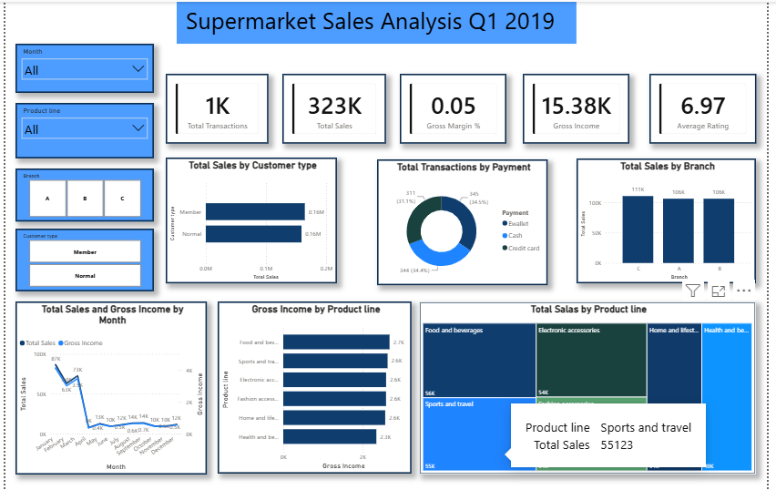

# Supermarket Sales Analysis

A Power BI project analyzing 1,000 point-of-sale transactions across three supermarket branches in Yangon, Mandalay, and Naypyitaw during Q1 2019.

The dashboard provides an interactive view of sales performance, gross income, customer behavior, product-line performance, payment methods, and monthly sales trends.

## Project Overview

The analysis focuses on identifying sales patterns and performance differences across:

- Branch and city
- Product line
- Customer type
- Payment method
- Monthly sales trends
- Customer ratings

The project demonstrates practical Power BI skills in data analysis, KPI development, interactive visualization, and business insight generation.

## Dashboard Preview



## Key KPIs

| KPI | Value |
|---|---:|
| Total Sales | $322,966.75 |
| Total COGS | $307,587.38 |
| Gross Income | $15,379.37 |
| Gross Margin | 4.76% |
| Total Quantity Sold | 5,510 |
| Total Transactions | 1,000 |
| Average Transaction Value | $322.97 |
| Average Customer Rating | 6.97 / 10 |

## Dashboard Analysis

The Power BI dashboard provides insights into:

### Branch Performance
Sales are broadly balanced across the three branches, with Branch C slightly leading the period.

### Product Line Performance
Food and beverages is the top-performing product line, while Health and beauty records the lowest sales and gross income, although the overall differences between categories are relatively modest.

### Customer Analysis
Member and Normal customers contribute almost equally to total sales and transaction volume, with no meaningful difference in average customer rating.

### Payment Methods
Cash and Ewallet are the most frequently used payment methods, while Credit card transactions represent a smaller share of total transactions.

### Monthly Trends
January records the highest sales and transaction volume. February shows a noticeable decline before sales recover in March.

## Key Business Insights

- Overall performance is balanced across branches, product lines, and customer segments.
- Branch C is the strongest branch, but only by a narrow margin.
- Food and beverages is the leading product line.
- Health and beauty is the lowest-performing product line and may warrant further investigation.
- Membership status does not currently show a meaningful advantage in customer spending.
- February represents a noticeable short-term decline in sales and transaction volume.
- Gross margin remains structurally consistent at approximately 4.76% across the dataset.

For the detailed analysis, findings, and recommendations, see [`Insights.md`](Insights.md).

## Dataset

The project uses the `supermarket_sales.csv` dataset containing 1,000 point-of-sale transactions from three supermarket branches during January–March 2019.

The dataset includes information related to:

- Invoice and transaction details
- Branch and city
- Customer type
- Product line
- Quantity
- Sales
- Cost of goods sold
- Gross income
- Payment method
- Customer rating
- Transaction date and time

## Tools & Technologies

- Power BI
- Power Query
- DAX
- Data Visualization
- Business Analysis

## Repository Structure

```text
Dataset/
└── supermarket_sales.csv

Power BI/
└── Supermarket_Sales_Analysis.pbix

Insights.md
README.md
```

## Conclusion

The project demonstrates how Power BI can be used to transform transactional supermarket data into an interactive business dashboard and generate actionable insights around sales performance, customers, products, payment methods, and trends.
